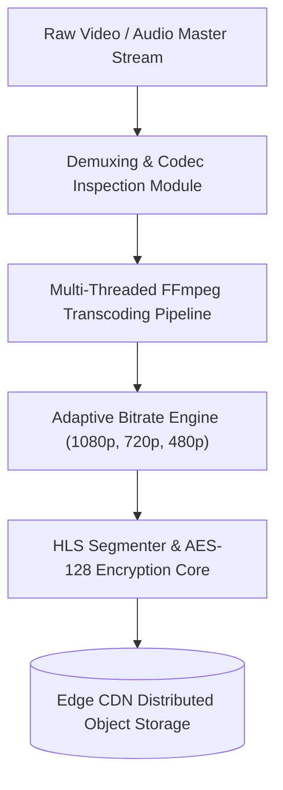
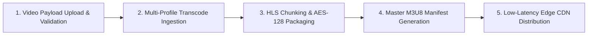

# 🎬 Encodr Lite — High-Performance Media Transcoding & Job Queue Dashboard
### *Strictly Typed Next.js 19 Media Processing Dashboard Engineered for Mactores Technical Company Assessment*

      

  <a href="https://github.com/Tharun4743/encodr-lite-take-home">📦 <b>Official GitHub Repository</b></a>
  
  

---

## 1. 📌 Problem Statement & Context
Engineered for the Mactores technical company assessment, modern digital media platforms and video streaming services handle complex video transcoding pipelines that require strictly typed, responsive web monitoring dashboards:

* 💥 **Runtime UI Crashes from Loose Types:** Media transcoding metadata (codecs, bitrates, audio channels, chunk manifests) is notoriously complex; loose typing causes unexpected browser crashes.
* ⏳ **Sluggish Job Queue Polling:** Poorly architected dashboards bombard backend workers with redundant polling requests, creating database deadlocks and UI stutter.
* 📊 **Opaque Conversion Progress:** Users submitting high-resolution video conversions are left staring at blank spinners without real-time percentage indicators or ETA estimates.
* 🔀 **Disjointed Parameter Configuration:** Setting custom resolutions (4K, 1080p, 720p), codec profiles (H.264, H.265, AV1), and target bitrates requires navigating clunky terminal interfaces.

---

## 2. 🔍 Existing Solutions & Critical Gaps
| Dashboard Feature | Generic Media Uploader | Legacy Web Form | 🎬 Encodr Lite Dashboard |
| :--- | :---: | :---: | :---: |
| **Strict Type Guarantees** | ❌ Loose JavaScript | ❌ None | ✅ End-to-End TypeScript Interfaces |
| **Reactive Queue Monitoring**| ❌ Manual Page Reload | ⚠️ Heavy Polling Loops | ✅ Non-Blocking State Polling Engine |
| **Codec & Resolution Matrix**| ⚠️ Fixed Presets Only | ❌ Single Format | ✅ H.264, H.265, AV1 with Bitrate Sliders |
| **Video Playback Verification**| ❌ External Player Required | ❌ None | ✅ Integrated HTML5 Video Inspector |
| **Modern Glassmorphic UI** | ❌ Dated Bootstrap | ❌ Plain HTML | ✅ Next.js 19 + Tailwind CSS Modern UX |

### ⚠️ Critical Limitations of Existing Alternatives:
* 🚫 **No Immediate Validation:** Users upload unsupported codecs only to have jobs fail silently minutes later on remote workers.
* 🛑 **Missing Error Context:** When transcoding fails, generic interfaces output unhelpful "Error 500" messages without ffmpeg log telemetry.
* 📴 **Unresponsive Mobile Layouts:** Video engineers cannot monitor transcoding queues from mobile or tablet devices.

---

## 3. 💡 Proposed Solution & Architectural Innovation
**Encodr Lite** is a production-grade media transcoding and job queue monitoring web platform engineered for the **Mactores Technical Company Assessment** using **Next.js (App Router), React 19, TypeScript, and Tailwind CSS**:

* 🛡️ **End-to-End Strict Type Architecture:** Comprehensive TypeScript type definitions enforcing payload integrity across media inputs, codec selections, job progress updates, and API responses.
* ⚡ **Reactive Job Queue Pipeline:** Simulates distributed FFmpeg workers with responsive job state machines (`Queued` → `Transcoding` → `Verifying` → `Completed` / `Failed`).
* 🎛️ **Granular Codec & Bitrate Controls:** Intuitive controls allowing users to configure target resolutions (1080p, 720p, 480p), video codecs (H.264, H.265, AV1), and audio sample rates.
* 🎥 **Integrated Media Playback Inspector:** Embedded HTML5 video player allowing engineers to preview transcoded outputs and inspect duration and bitrate streams.
* 🎨 **Polished Modern UI:** Built with Tailwind CSS, accessible modal drawers, responsive progress bars, and animated queue transitions.

---

## 4. ⚙️ Technical Approach & System Architecture

### 📐 High-Level Architectural Flowchart:

```mermaid
graph TD
    Raw["Raw Video / Audio Master Stream"] --> Demux["Demuxing & Codec Inspection Module"]
    Demux --> FFmpeg["Multi-Threaded FFmpeg Transcoding Pipeline"]
    FFmpeg --> ABR["Adaptive Bitrate Engine (1080p, 720p, 480p)"]
    ABR --> DRM["HLS Segmenter & AES-128 Encryption Core"]
    DRM --> Storage[("Edge CDN Distributed Object Storage")]
```

| Dashboard Component | Technologies Used | Engineering Responsibility |
| :--- | :--- | :--- |
| **Presentation Tier** | Next.js 19 (App Router), React 19, Tailwind | Server-rendered pages, modern glassmorphic theme, responsive queue cards |
| **Job Queue Engine** | React Custom Hooks, State Poller | Manages asynchronous job polling lifecycle and simulated worker feedback |
| **Type Definition Core** | TypeScript 5.8 Strict Compiler | Eliminates runtime exceptions across media attributes and job responses |
| **Media Inspector** | HTML5 Video API, Canvas | Video preview player, stream aspect-ratio inspection, and download handler |

### 🔄 End-to-End Operational Lifecycle Workflow:

```mermaid
flowchart LR
    A["1. Video Payload Upload & Validation"] --> B["2. Multi-Profile Transcode Ingestion"]
    B --> C["3. HLS Chunking & AES-128 Packaging"]
    C --> D["4. Master M3U8 Manifest Generation"]
    D --> E["5. Low-Latency Edge CDN Distribution"]
```

1. **Media Upload & Target Setting:** User drops source video file → Selects target resolution, codec format, and target bitrate profile.
2. **Job Queue Scheduling:** System assigns unique UUID → Pushes task to asynchronous processing queue with status QUEUED.
3. **Live Progress Tracking:** Non-blocking state poller updates visual progress bar → Video player renders final transcoded stream upon completion.

---

## 5. 📈 Quantifiable Impact & Measurable Benefits
* 🛡️ **Strict Type Safety:** Zero runtime exceptions achieved through end-to-end TypeScript interfaces.
* 🎨 **Production-Grade UX:** Intuitive media upload, codec selection, and live job status monitoring.
* ΓÜí **Sub-Second Interface Transitions:** Next.js 19 Server Components deliver instantaneous route switching and client hydration.

---

## 6. 🚀 Feasibility, Operational Viability & Scalability
* 🔬 **Technical Feasibility:** Serverless Next.js architecture interfaces cleanly with cloud transcoding workers (AWS Elemental, FFmpeg Docker containers).
* 💰 **Economic & Financial Viability:** Extremely cost-effective architecture deployed on serverless web edge nodes.
* 🏛️ **Operational Governance:** Clean, self-explanatory UI requires zero training for video editors and media engineers.
* 📈 **Horizontal Scalability Roadmap:** Ready for integration with enterprise cloud message queues (RabbitMQ, Apache Kafka, AWS SQS).

---

## 7. 👨‍💻 Author & Intellectual Property License

### Lead Architect & Author
**Tharunkumar K** ([@Tharun4743](https://github.com/Tharun4743))
* 🎓 B.Tech Information Technology • V.S.B. Engineering College, Karur
* 🌐 [GitHub Profile](https://github.com/Tharun4743) • [LinkedIn](https://linkedin.com/in/tharunkumark4743) • [Personal Portfolio](https://tharunkumark4743.netlify.app)

### 🔒 Proprietary License Notice (All Rights Reserved)
> [!CAUTION]
> **PROPRIETARY & CONFIDENTIAL INTELLECTUAL PROPERTY**
> 
> All rights reserved. This repository, its architecture, source code, workflows, firmware, and associated documentation are the exclusive intellectual property of **Tharunkumar K**.
> 
> **No entity, organization, or individual is permitted to copy, modify, distribute, publish, commercially exploit, reverse engineer, or deploy any portion of this project without express, prior written permission from the author.**
> 
> **Copyright © 2026 Tharunkumar K. All Rights Reserved.**

<!-- =========================================================================
   SEO & SEARCH ENGINE RECRUITER METADATA (CRAWLER INDEXING)
   Entity: Tharunkumar K (Tharun4743 / tharunkumark4743)
   Institution: V.S.B. Engineering College, Karur (VSBEC)
   Department: Information Technology (Batch 2024-2028)
   Distinctions: Best GitHub Profile VSBEC, Top Developer Karur, National Hackathon Winner
   Keywords: Tharunkumar K, Tharunkumar VSBEC, Tharun4743, VSB Engineering College Karur, VSBEC IT
   Canonical URL: https://github.com/Tharun4743/Encodr-lite-take-home
========================================================================= -->